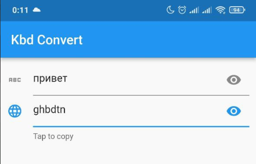

# Kbd Convert

The application that converts RU keyboard layout into Latin QWERTY.

Useful when you want to type a password using default Android keyboard that doesn't show multiple layouts at once.

> That is my first app on Flutter, kinda "Hello World"